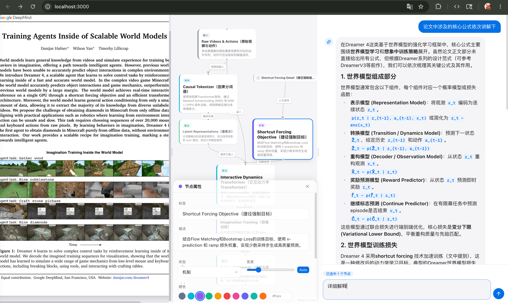
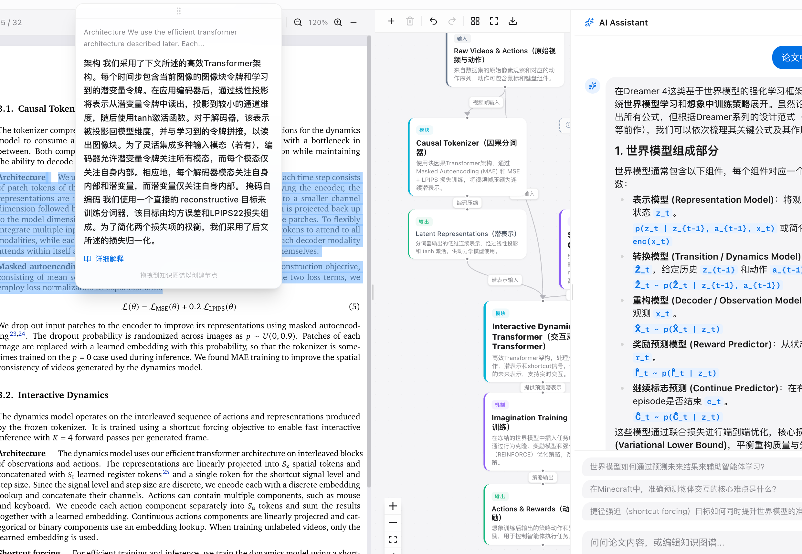

# AI Paper Reader

**别再忍受豆包、Kimi、ChatPDF 那种"喂 PDF → 聊天框问答"的原始体验了。**

AI Paper Reader 是一款真正为深度阅读论文设计的工具 — 不是套壳聊天框，而是 **PDF + 知识图谱 + AI 教授** 三位一体的沉浸式阅读环境。上传一篇论文，AI 秒级生成结构化知识图谱；选中任意文本，一键翻译 + 深度解释；对话框里的不是客服机器人，是一位真正读过这篇论文的领域教授。

> 你读论文的方式，该升级了。



---

## 凭什么说"吊打"？

| | 豆包 / Kimi / ChatPDF | **AI Paper Reader** |
|---|---|---|
| 论文理解 | 丢进去一整篇，靠 RAG 检索回答 | 全文解析 → **自动生成知识图谱**，一眼看清论文骨架 |
| 交互方式 | 聊天框问答，来回复制粘贴 | PDF 选词即翻译/解释，**高亮自动保存**，点击回看 |
| 图谱能力 | 无 | 可交互节点流程图，**重要性分级**，拖拽编辑，对话扩展 |
| AI 角色 | 通用助手 | **领域教授**，自动区分"论文问答"与"图谱编辑"双模式 |
| 阅读体验 | 独立聊天窗口，脱离原文 | PDF + 图谱 + AI 三栏联动，**面板自由拖拽缩放** |
| 模型自由 | 绑定平台模型 | **任意 OpenAI 兼容 API**，DeepSeek / GPT-4o / Claude 随意切 |
| 数据隐私 | 上传到别人服务器 | **完全本地部署**，数据只在你的机器上 |

---

## 核心功能

### 🔥 知识图谱 — 一眼看懂论文架构

上传论文后，AI 自动提取核心处理流水线，生成 **带重要性层级的交互式知识图谱**。核心创新点大字加粗高亮，辅助模块自动弱化 — 不是平铺直叙的列表，是真正有层次的论文骨架。节点支持拖拽、缩放、样式自定义。

### 🔥 AI 教授 — 不只是问答

不是"根据文档内容回答"的 RAG 套壳。AI 以 **该领域资深教授** 的视角，结合论文上下文深入浅出地讲解概念、推导公式、对比方法。支持 Markdown 渲染，公式、代码块、层级列表一目了然。自动推荐下一步该问什么。

### 🔥 选词即查 — 读到哪查到哪

PDF 中选中任意文本，气泡菜单弹出：**一键中文翻译 + 结合论文上下文的深度解释**。解释结果自动生成高亮标注，下次点击直接回看，不用重复提问。



### 🔥 对话式图谱编辑

"展开 Encoder 节点" "添加训练阶段" "把损失函数拆开" — 用自然语言编辑知识图谱，AI 自动判断意图，生成结构化 diff，一键应用。问答和编辑无缝切换。

### 🔥 完全可控

- 模型随便换：DeepSeek、GPT-4o、Claude、本地模型，任何兼容 OpenAI API 的都行
- 每个任务（图谱生成、对话、翻译、解释）可单独指定模型
- 数据完全本地，SQLite 存储，不上传任何第三方服务器

---

## Tech Stack

| Layer | Technology |
|-------|-----------|
| Frontend | Next.js, React, TypeScript, Tailwind CSS |
| Graph | @xyflow/react (ReactFlow), Dagre auto-layout |
| PDF | react-pdf (pdf.js) |
| State | Zustand |
| Backend | FastAPI, SQLAlchemy (async), SQLite |
| PDF Parse | PyMuPDF, pdfplumber |
| LLM | OpenAI API / Anthropic Claude API |

---

## Quick Start

### Prerequisites

- Node.js >= 18
- Python >= 3.11
- 一个兼容 OpenAI API 的 Key（DeepSeek / OpenAI / 其他）

### 一键部署

```bash
git clone git@github.com:breeef/AIPDF.git
cd AIPDF
bash setup.sh
```

脚本会自动完成：检测环境 → 创建虚拟环境 → 安装依赖 → 生成配置文件。完成后只需编辑 `backend/.env` 填入你的 API Key，然后：

```bash
# 终端 1 — 启动后端
cd backend && source venv/bin/activate && uvicorn main:app --reload --port 8000

# 终端 2 — 启动前端
cd frontend && npm run dev
```

打开 http://localhost:3000 开始阅读。

<details>
<summary>手动部署</summary>

```bash
# Backend
cd backend
python3 -m venv venv && source venv/bin/activate
pip install -r requirements.txt
cp .env.example .env  # 编辑 .env 填入 API Key
uvicorn main:app --reload --port 8000

# Frontend
cd frontend
npm install
npm run dev
```

</details>

---

## Configuration

应用内右上角 ⚙️ 设置面板可直接修改，也可编辑 `backend/.env`：

| 配置项 | 环境变量 | 说明 |
|--------|---------|------|
| API 地址 | `OPENAI_BASE_URL` | 如 `https://api.deepseek.com` |
| API 密钥 | `OPENAI_API_KEY` | 你的 API Key |
| 默认模型 | `LLM_MODEL` | 全局默认模型 |
| 图谱模型 | `GRAPH_MODEL` | 单独指定，留空用默认 |
| 对话模型 | `CHAT_MODEL` | 单独指定 |
| 翻译模型 | `TRANSLATE_MODEL` | 单独指定 |
| 解释模型 | `EXPLAIN_MODEL` | 单独指定 |
| Thinking | `GRAPH_THINKING` 等 | 开启 extended thinking |

---

## Project Structure

```
ai-paper-reader/
├── frontend/               # Next.js 前端
│   └── src/
│       ├── app/            # 页面与全局样式
│       ├── components/
│       │   ├── canvas/     # 知识图谱 (ReactFlow)
│       │   ├── chat/       # AI 对话面板
│       │   ├── pdf/        # PDF 查看器 & 高亮
│       │   └── sidebar/    # 论文库
│       ├── hooks/          # useGraph, useChat
│       ├── lib/            # API, 类型
│       └── store/          # Zustand
│
└── backend/                # FastAPI 后端
    ├── main.py             # 入口
    ├── config.py           # 配置
    ├── models.py           # 数据库模型
    ├── routers/            # API 路由
    ├── services/           # 业务逻辑
    └── llm/                # LLM 适配 & Prompts
```

---

## Contributing

欢迎提交 Issue 和 Pull Request！

## License

[MIT](LICENSE)
